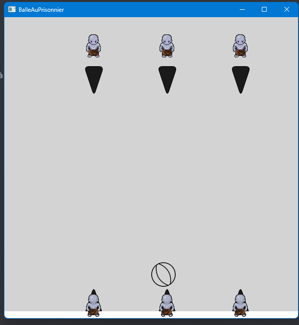

# CAPI : Balle au prisonnier
Projet réalisé par Arthur *PARMENTIER*, Cyrielle *BARAILLER* et Victor *SIGOGNEAU*
***
Dans le cadre de notre 1ère année de Master Informatique à l'Université Lumière Lyon 2, nous avons suivi le cours de Conception agile de projets informatiques et génie logiciel de Valentin *LACHAND-PASCAL*. Lors de ce cours nous devions produire un jeu simulant une partie de balle au prisonnier que vous pouvez retrouver sur ce GitHub.

## _Statut du projet_

Actuellement le projet est toujours en développement et n'est pas terminé. En effet toutes les fonctionnalités demandées n'ont pas été mise en place dans notre version. 

## _Environnement_

- Langage de programmation principal : **Java 17** [Site officiel]()
- Framework utilisé pour l'interface graphique : **JavaFX** [Site officiel](https://openjfx.io/)
- Outil de build : **Maven** [Site officiel](https://maven.apache.org/)

## _Installation et lancement du projet_
**Prérequis** : Assurez-vous d'avoir [Maven](https://maven.apache.org/) installé sur votre ordinateur

Vous pouvez ensuite : 
1. Télécharger le dossier du projet
2. Ouvrir un terminal à la racine du projet
3. Utiliser la commande `mvn javafx:run`
4. Le jeu se lance et vous pouvez jouer en suivant les commandes décrites en dessous

## _Commandes_
Pour le **Joueur 1**  (en bas) :
| Déplacement | Touche |
| ------ | ------ |
| Droite | Flèche droite |
| Gauche | Flèche gauche |
| Orienter le joueur à droite | Flèche du bas |
| Orienter le joueur à gauche | Flèche du haut |
| Tirer la balle | Espace |

Pour le **Joueur 2** (en haut) : 
| Déplacement | Touche |
| ------ | ------ |
| Droite | D |
| Gauche | Q |
| Orienter le joueur à droite | S |
| Orienter le joueur à gauche | Z |
| Tirer la balle | 0 sur le NumPad ou 0 (touche à) |
